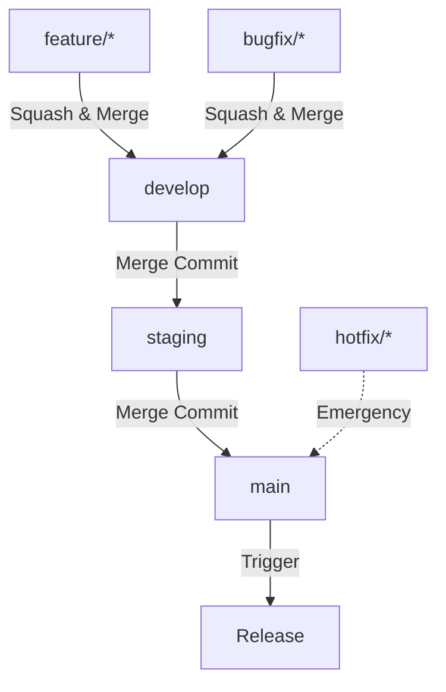

# Branch Strategy

This template implements a three-branch Git workflow optimized for library development with staging and production environments.

## Overview

The strategy uses three protected branches:

1. **main** - Production releases
2. **staging** - Pre-production testing
3. **develop** - Active development

Plus temporary branches for features, bugfixes, and hotfixes.

## Branch Hierarchy



## Branch Descriptions

### Main Branch

**Purpose**: Production-ready code

**Characteristics**:
- Protected branch
- Only receives merges from staging
- Each merge triggers automatic release
- Tagged with semantic versions
- Deployed to production

**Rules**:
- Requires pull request
- Requires code review approval
- Status checks must pass
- No force push allowed
- No deletion allowed

**Merge Strategy**: Merge commit (preserves history)

### Staging Branch

**Purpose**: Pre-production testing and release preparation

**Characteristics**:
- Protected branch
- Receives merges from develop
- Integration testing environment
- Final quality checks
- Changelog review

**Rules**:
- Requires pull request
- Requires code review approval
- Status checks must pass
- No force push allowed
- No deletion allowed

**Merge Strategy**: Merge commit (preserves history)

### Develop Branch

**Purpose**: Integration branch for active development

**Characteristics**:
- Protected branch
- Receives merges from feature/bugfix branches
- Continuous integration testing
- Latest development changes
- May be unstable at times

**Rules**:
- Requires pull request
- Requires code review approval
- Status checks must pass
- No force push allowed
- No deletion allowed

**Merge Strategy**: Squash and merge from features (clean history)

### Feature Branches

**Pattern**: `feature/*`

**Purpose**: Develop new features in isolation

**Characteristics**:
- Temporary branches
- Branched from develop
- Merged to develop
- Deleted after merge
- One feature per branch

**Naming Examples**:
```bash
feature/user-authentication
feature/dark-mode
feature/api-caching
feature/export-to-pdf
```

**Lifecycle**:
```bash
# Create
git checkout develop
git pull
git checkout -b feature/my-feature

# Develop
git add .
git commit -m "feat: add my feature"

# Push
git push -u origin feature/my-feature

# Create PR
gh pr create --base develop

# After merge
git checkout develop
git pull
git branch -d feature/my-feature
```

### Bugfix Branches

**Pattern**: `bugfix/*`

**Purpose**: Fix non-critical bugs

**Characteristics**:
- Temporary branches
- Branched from develop
- Merged to develop
- Deleted after merge
- One bug per branch

**Naming Examples**:
```bash
bugfix/login-redirect
bugfix/date-formatting
bugfix/memory-leak
bugfix/broken-link
```

**Lifecycle**: Same as feature branches

### Hotfix Branches

**Pattern**: `hotfix/*`

**Purpose**: Emergency fixes for production

**Characteristics**:
- Temporary branches
- Branched from main
- Merged directly to main AND develop
- Critical issues only
- Deleted after merge

**Naming Examples**:
```bash
hotfix/security-vulnerability
hotfix/data-corruption
hotfix/system-crash
hotfix/critical-api-error
```

**Lifecycle**:
```bash
# Create from main
git checkout main
git pull
git checkout -b hotfix/critical-issue

# Fix
git add .
git commit -m "fix: resolve critical issue"

# Push
git push -u origin hotfix/critical-issue

# Create PR to main
gh pr create --base main --label hotfix

# After merge to main, also merge to develop
git checkout develop
git merge main
git push
```

### Release Branches (Optional)

**Pattern**: `release/*`

**Purpose**: Prepare specific releases

**Characteristics**:
- Optional (not always used)
- Branched from develop
- Merged to staging
- Version bumps and changelog
- Final release preparation

**Naming Examples**:
```bash
release/v2.0.0
release/v1.5.0
release/2024-q1
```

## Merge Strategies

### Squash and Merge

**Used for**: Feature → Develop, Bugfix → Develop

**Benefits**:
- Clean, linear history
- One commit per feature
- Easy to revert
- Simplified changelog

**Example**:
```
Before (messy history):
  a1b2c3d feat: start feature
  e4f5g6h wip: progress
  i7j8k9l fix typo
  m0n1o2p feat: complete feature

After (clean history):
  a1b2c3d feat: add user authentication
```

### Merge Commit

**Used for**: Develop → Staging, Staging → Main

**Benefits**:
- Preserves full history
- Shows branch points
- Easier to trace changes
- Better for release tracking

**Example**:
```
  * Merge develop into staging
  |\
  | * feat: add dark mode
  | * feat: add export feature
  |/
  * Previous staging commit
```

## Workflow Examples

### Developing a Feature

```bash
# 1. Start from develop
git checkout develop
git pull origin develop

# 2. Create feature branch
git checkout -b feature/user-profile

# 3. Develop (multiple commits OK)
git add .
git commit -m "feat: add profile page"
git add .
git commit -m "feat: add edit functionality"
git add .
git commit -m "fix: handle edge case"

# 4. Push branch
git push -u origin feature/user-profile

# 5. Create PR
gh pr create \
  --base develop \
  --title "Add user profile page" \
  --body "Implements user profile with edit capability"

# 6. After approval and merge, cleanup
git checkout develop
git pull
git branch -d feature/user-profile
```

### Preparing a Release

```bash
# 1. Merge develop to staging
git checkout staging
git pull origin staging
git merge develop
git push origin staging

# 2. Test on staging environment

# 3. When ready, merge staging to main
git checkout main
git pull origin main
git merge staging
git push origin main

# 4. Automatic release triggers
# - Changelog generated
# - Version bumped
# - Tag created
# - GitHub release published
```

### Handling a Hotfix

```bash
# 1. Create from main
git checkout main
git pull origin main
git checkout -b hotfix/security-patch

# 2. Apply fix
git add .
git commit -m "fix: patch security vulnerability"

# 3. Push and create PR
git push -u origin hotfix/security-patch
gh pr create \
  --base main \
  --title "[HOTFIX] Security patch" \
  --label hotfix

# 4. After merge to main
# Automatic release will trigger

# 5. Merge to develop to keep in sync
git checkout develop
git pull origin develop
git merge main
git push origin develop

# 6. Cleanup
git branch -d hotfix/security-patch
```

## Branch Protection Rules

### Configuration

Use the provided setup scripts:

```bash
# Option 1: Shell script
./scripts/setup.sh your-org your-repo your-token

# Option 2: Node.js script
node scripts/setup.js your-org your-repo your-token
```

### Protection Settings

For main, staging, and develop:

```json
{
  "required_status_checks": {
    "strict": true,
    "contexts": ["Validate Branch Naming Convention"]
  },
  "enforce_admins": true,
  "required_pull_request_reviews": {
    "required_approving_review_count": 1,
    "dismiss_stale_reviews": true
  },
  "restrictions": null,
  "allow_force_pushes": false,
  "allow_deletions": false
}
```

**What this means**:

- ✅ Requires PR (no direct commits)
- ✅ Requires 1 approval
- ✅ Requires status checks to pass
- ✅ Applies to admins
- ✅ Dismisses stale reviews
- ❌ No force push
- ❌ No branch deletion

## Best Practices

### Do

1. **Keep branches short-lived** - Merge within days, not weeks
2. **Pull before branching** - Start from latest code
3. **One purpose per branch** - Feature OR bugfix, not both
4. **Use descriptive names** - `feature/add-user-auth` not `feature/stuff`
5. **Delete after merge** - Clean up merged branches
6. **Test before merging** - Ensure CI passes
7. **Review your own code** - Before requesting review
8. **Keep commits atomic** - One logical change per commit

### Don't

1. **Don't commit directly to protected branches** - Always use PRs
2. **Don't mix features** - One branch per feature
3. **Don't let branches go stale** - Merge or close
4. **Don't force push** - Especially to shared branches
5. **Don't bypass CI** - Let checks complete
6. **Don't skip code review** - Even for "quick fixes"
7. **Don't merge broken code** - Fix failures first
8. **Don't leave broken staging** - Fix or revert immediately

## Troubleshooting

### Branch Out of Date

```bash
# Update your feature branch with latest develop
git checkout feature/my-feature
git fetch origin
git merge origin/develop

# Or rebase (cleaner history)
git rebase origin/develop
```

### Merge Conflicts

```bash
# 1. Update with latest target branch
git fetch origin
git merge origin/develop

# 2. Resolve conflicts in editor

# 3. Mark as resolved
git add conflicted-file.ts

# 4. Complete merge
git commit

# 5. Push
git push
```

### Accidentally Committed to Wrong Branch

```bash
# Move commit to correct branch
git checkout wrong-branch
git log  # Copy commit SHA

git checkout correct-branch
git cherry-pick <commit-sha>

git checkout wrong-branch
git reset --hard HEAD~1  # Remove commit
```

### Need to Undo a Merge

```bash
# If merge not pushed yet
git reset --hard HEAD~1

# If merge already pushed
git revert -m 1 <merge-commit-sha>
git push
```

## Comparison with Other Strategies

### vs Git Flow

| Aspect | This Template | Git Flow |
|--------|---------------|----------|
| Branches | 3 long-lived | 2 long-lived |
| Releases | Auto from main | Manual release branch |
| Hotfixes | Direct to main | Branch from main |
| Complexity | Medium | High |
| Best for | Libraries | Applications |

### vs GitHub Flow

| Aspect | This Template | GitHub Flow |
|--------|---------------|-------------|
| Branches | 3 long-lived | 1 long-lived |
| Staging | Yes | No |
| Testing | Staging branch | Production |
| Complexity | Medium | Low |
| Best for | Libraries | Web apps |

### vs Trunk-Based

| Aspect | This Template | Trunk-Based |
|--------|---------------|-------------|
| Branches | 3 long-lived | 1 long-lived |
| Features | Feature branches | Feature flags |
| Integration | Develop branch | Continuous |
| Complexity | Medium | Low |
| Best for | Libraries | Microservices |

## Migration from Other Strategies

### From Git Flow

```bash
# Rename master to main
git branch -m master main
git push -u origin main

# Delete old release branches (after documenting)
git branch -d release/*

# Keep hotfix pattern (compatible)
```

### From GitHub Flow

```bash
# Create staging and develop branches
git checkout -b staging
git push -u origin staging

git checkout -b develop
git push -u origin develop

# Set up branch protection
./scripts/setup.sh
```

## Related Documentation

- [CI/CD Workflows](cicd-workflows.md) - How workflows integrate with branches
- [Commit Management](commit-management.md) - Commit format for releases
- [GitHub Templates](github-templates.md) - PR templates for merges
- [Branch Protection Setup](../technical/branch-protection.md) - Technical setup details
