# CI/CD Workflows

This template includes three GitHub Actions workflows that automate code validation, review, and release processes.

## Overview

The template provides:

1. **Branch Naming Validation** - Enforces branch naming conventions
2. **Code Review Automation** - GitHub Copilot-powered PR reviews
3. **Automatic Release** - Semantic versioning and changelog generation

## Branch Naming Validation

### Purpose

Ensures all branches follow the team's naming conventions, maintaining organization and clarity.

### Configuration

**File**: `.github/workflows/branchname-validation.yml`

### Trigger Events

```yaml
on:
  push:
    branches-ignore:
      - main
      - develop
      - staging
  pull_request:
    branches:
      - main
      - develop
      - staging
```

**When it runs**:
- On push to any branch except main, develop, staging
- On PRs targeting main, develop, or staging

### Valid Branch Patterns

| Pattern | Purpose | Example |
|---------|---------|---------|
| `feature/*` | New features | `feature/user-authentication` |
| `release/*` | Release preparation | `release/v2.0.0` |
| `hotfix/*` | Critical production fixes | `hotfix/security-patch` |
| `bugfix/*` | Non-critical bug fixes | `bugfix/login-redirect` |

### Workflow Logic

```yaml
- name: Check branch name
  run: |
    branch="${{ github.ref_name }}"

    if [[ "$branch" =~ ^(feature|release|hotfix|bugfix)/.+ ]]; then
      echo "✅ Branch name '$branch' is valid"
      exit 0
    fi

    if [[ "$branch" == "main" || "$branch" == "develop" || "$branch" == "staging" ]]; then
      echo "✅ Protected branch '$branch'"
      exit 0
    fi

    echo "❌ Invalid branch name: '$branch'"
    echo "Valid patterns: feature/*, release/*, hotfix/*, bugfix/*"
    exit 1
```

### Error Messages

When validation fails:

```
❌ Invalid branch name: 'my-feature'

Branch names must follow one of these patterns:
  - feature/*  (for new features)
  - release/*  (for release preparation)
  - hotfix/*   (for critical fixes)
  - bugfix/*   (for non-critical bugs)

Examples:
  ✅ feature/add-dark-mode
  ✅ hotfix/security-patch
  ✅ bugfix/fix-login-issue
  ❌ my-feature (missing prefix)

To fix this:
  git branch -m my-feature feature/my-feature
  git push origin :my-feature feature/my-feature
```

### Bypassing Validation

Protected branches (main, develop, staging) automatically pass validation.

## Code Review Automation

### Purpose

Provides automated code reviews using GitHub Copilot, catching security issues, performance problems, and missing error handling.

### Configuration

**File**: `.github/workflows/code-review.yml`

### Trigger Events

```yaml
on:
  pull_request:
    types: [opened, synchronize]
```

**When it runs**:
- When PR is opened
- When new commits are pushed to PR

### Workflow Steps

1. **Checkout Code**
```yaml
- uses: actions/checkout@v4
  with:
    fetch-depth: 0  # Full history for better context
```

2. **Detect Changed Files**
```yaml
- name: Detect changed files
  id: changed-files
  run: |
    files=$(git diff --name-only origin/${{ github.base_ref }}...HEAD | head -10)
    echo "files<<EOF" >> $GITHUB_OUTPUT
    echo "$files" >> $GITHUB_OUTPUT
    echo "EOF" >> $GITHUB_OUTPUT
```

3. **Run GitHub Copilot Review**
```yaml
- name: Run GitHub Copilot code review
  run: |
    gh copilot suggest "Review these files for security vulnerabilities,
    performance issues, and missing error handling:
    ${{ steps.changed-files.outputs.files }}"
```

4. **Post Review Comment**
```yaml
- name: Post review comment
  run: |
    gh pr comment ${{ github.event.pull_request.number }} \
      --body "$REVIEW_CONTENT"
```

### Review Focus Areas

The automated review checks for:

- **Security vulnerabilities**
  - SQL injection
  - XSS attacks
  - Authentication issues
  - Sensitive data exposure

- **Performance issues**
  - N+1 queries
  - Inefficient loops
  - Memory leaks
  - Blocking operations

- **Error handling**
  - Uncaught exceptions
  - Missing try-catch blocks
  - Improper error propagation
  - Silent failures

### Example Review Output

```markdown
## 🤖 Automated Code Review

### Files Reviewed
- src/api/users.ts
- src/utils/database.ts

### Findings

#### 🔴 Security: SQL Injection Risk (High)
**File**: src/api/users.ts:45
**Issue**: User input directly concatenated into SQL query
**Suggestion**: Use parameterized queries or ORM

#### 🟡 Performance: N+1 Query (Medium)
**File**: src/utils/database.ts:23
**Issue**: Loading related data in a loop
**Suggestion**: Use eager loading or batch queries

#### 🔵 Error Handling: Missing Try-Catch (Low)
**File**: src/api/users.ts:67
**Issue**: Async operation not wrapped in error handling
**Suggestion**: Add try-catch block

### Summary
- 1 High priority issue
- 1 Medium priority issue
- 1 Low priority issue

Please address these findings before merging.
```

### Permissions

```yaml
permissions:
  contents: read
  pull-requests: write
  actions: read
```

Required for:
- Reading repository contents
- Posting PR comments
- Accessing GitHub Copilot

### Limitations

- Reviews up to 10 changed files
- Best-effort suggestions (not guaranteed to catch everything)
- Complements, not replaces, human review

## Automatic Release Workflow

### Purpose

Automates the entire release process:
- Generate changelog from commits
- Calculate semantic version
- Create git tag
- Publish GitHub release

### Configuration

**File**: `.github/workflows/release.yml`

### Trigger Events

```yaml
on:
  push:
    branches:
      - main
```

**When it runs**:
- When code is pushed to main branch
- Skips if commit message contains "chore(release)"

### Workflow Steps

#### 1. Checkout with Full History

```yaml
- uses: actions/checkout@v4
  with:
    fetch-depth: 0  # Full git history needed for changelog
    token: ${{ secrets.GITHUB_TOKEN }}
```

#### 2. Setup Node.js

```yaml
- name: Setup Node.js
  uses: actions/setup-node@v4
  with:
    node-version-file: '.nvmrc'
```

Uses the Node version specified in `.nvmrc` (20).

#### 3. Install Dependencies

```yaml
- name: Install dependencies
  run: |
    npm install
    npm install -g conventional-changelog-cli conventional-recommended-bump
```

#### 4. Check for New Commits

```yaml
- name: Check for commits since last tag
  id: check-commits
  run: |
    last_tag=$(git describe --tags --abbrev=0 2>/dev/null || echo "")
    if [ -z "$last_tag" ]; then
      echo "has_commits=true" >> $GITHUB_OUTPUT
    else
      commits=$(git log $last_tag..HEAD --oneline)
      if [ -n "$commits" ]; then
        echo "has_commits=true" >> $GITHUB_OUTPUT
      else
        echo "has_commits=false" >> $GITHUB_OUTPUT
      fi
    fi
```

#### 5. Generate Changelog

```yaml
- name: Generate changelog
  run: |
    npx conventional-changelog -p angular -i CHANGELOG.md -s
```

Uses Angular preset for conventional commits.

**Example Output**:

```markdown
## [2.1.0] (2024-01-15)

### Features
* add dark mode toggle ([abc123])
* implement user authentication ([def456])

### Bug Fixes
* resolve memory leak in data processing ([ghi789])
* fix incorrect date formatting ([jkl012])
```

#### 6. Calculate Version Bump

```yaml
- name: Calculate version bump
  id: version-bump
  run: |
    bump=$(npx conventional-recommended-bump -p angular)
    echo "bump=$bump" >> $GITHUB_OUTPUT
```

Determines if version should be:
- **major** (breaking changes)
- **minor** (new features)
- **patch** (bug fixes)

#### 7. Update Package Version

```yaml
- name: Update package.json version
  id: version
  run: |
    current=$(node -p "require('./package.json').version")
    new=$(npx semver $current -i ${{ steps.version-bump.outputs.bump }})
    npm version $new --no-git-tag-version
    echo "version=$new" >> $GITHUB_OUTPUT
```

#### 8. Create Git Tag

```yaml
- name: Create tag
  run: |
    git tag -a "v${{ steps.version.outputs.version }}" \
      -m "Release v${{ steps.version.outputs.version }}"
```

#### 9. Push Changes

```yaml
- name: Push changes
  run: |
    git config user.name "github-actions[bot]"
    git config user.email "github-actions[bot]@users.noreply.github.com"
    git add CHANGELOG.md package.json
    git commit -m "chore(release): v${{ steps.version.outputs.version }}"
    git push origin main --follow-tags
```

#### 10. Create GitHub Release

```yaml
- name: Create GitHub Release
  env:
    GITHUB_TOKEN: ${{ secrets.GITHUB_TOKEN }}
  run: |
    gh release create "v${{ steps.version.outputs.version }}" \
      --title "Release v${{ steps.version.outputs.version }}" \
      --generate-notes
```

### Release Output

The workflow creates:

1. **Updated CHANGELOG.md**
   ```markdown
   ## [2.1.0] (2024-01-15)

   ### Features
   * add user authentication

   ### Bug Fixes
   * resolve login issue
   ```

2. **Git Tag**
   ```
   v2.1.0
   ```

3. **GitHub Release**
   - Title: "Release v2.1.0"
   - Auto-generated release notes
   - Links to commits and PRs
   - Downloadable source code

### Skip Release

To push to main without triggering a release:

```bash
git commit -m "chore(release): v1.2.3"
# Contains "chore(release)" so workflow skips
```

## Workflow Integration

### Complete Flow

```mermaid
sequenceDiagram
    participant D as Developer
    participant B as Branch Validation
    participant C as Code Review
    participant R as Release

    D->>B: Push feature/my-branch
    B->>D: ✅ Branch name valid

    D->>C: Open PR
    C->>D: 🤖 Automated review posted

    D->>D: Address review comments
    D->>C: Push updates
    C->>D: 🤖 Updated review

    D->>R: Merge to main
    R->>R: Generate changelog
    R->>R: Bump version
    R->>R: Create tag
    R->>D: 📦 Release published
```



## Monitoring and Debugging

### View Workflow Runs

```bash
# List recent workflow runs
gh run list

# View specific workflow
gh run list --workflow=release.yml

# View run details
gh run view <run-id>

# View logs
gh run view <run-id> --log
```

### Common Issues

#### Branch Validation Fails

```bash
# Fix: Rename branch
git branch -m new-name feature/new-name
git push origin :old-name feature/new-name
```

#### Code Review Not Posted

Check permissions:
```yaml
permissions:
  pull-requests: write  # Required for comments
```

#### Release Not Created

1. Check commit messages follow conventional commits
2. Verify there are commits since last tag
3. Check GITHUB_TOKEN has write permissions

### Manual Trigger

Workflows can be manually triggered:

```bash
# Trigger workflow manually
gh workflow run release.yml

# Or via GitHub UI
# Actions → Workflow → Run workflow
```

## Customization

### Modify Branch Patterns

Edit `.github/workflows/branchname-validation.yml`:

```yaml
if [[ "$branch" =~ ^(feat|fix|docs|custom)/.+ ]]; then
```

### Customize Code Review

Edit `.github/workflows/code-review.yml`:

```yaml
gh copilot suggest "Review for:
1. Code style consistency
2. Test coverage
3. Documentation quality
Files: ${{ steps.changed-files.outputs.files }}"
```

### Change Changelog Format

Edit `.github/workflows/release.yml`:

```yaml
# Use different preset
npx conventional-changelog -p atom -i CHANGELOG.md -s
```

Available presets: angular, atom, ember, eslint, express, jquery

## Best Practices

1. **Don't skip workflows** - They catch real issues
2. **Review automated suggestions** - Not all are critical
3. **Keep workflows updated** - As GitHub Actions evolves
4. **Monitor workflow failures** - Fix promptly
5. **Use conventional commits** - Enables semantic versioning

## Related Documentation

- [Branch Strategy](branch-strategy.md) - How branches flow through workflows
- [Commit Management](commit-management.md) - Commit format for releases
- [GitHub Templates](github-templates.md) - PR template for reviews
- [GitHub Actions Details](../technical/github-actions.md) - Technical implementation
