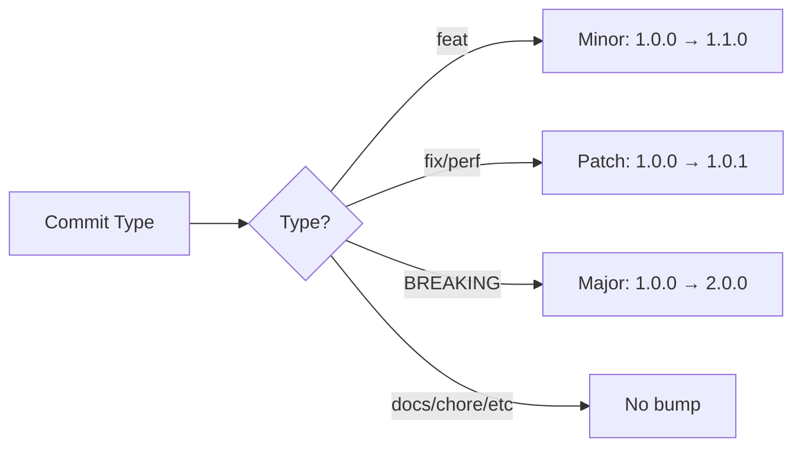

# Commit Management

This template enforces structured commit messages using Conventional Commits, enabling automated changelog generation and semantic versioning.

## Conventional Commits

### What Are Conventional Commits?

Conventional Commits is a specification for commit messages that:

- Provides a structured format for commit history
- Enables automated changelog generation
- Determines semantic version bumps (major/minor/patch)
- Improves collaboration and code review

### Format

```
<type>(<scope>): <subject>

<body>

<footer>
```

### Components

#### Type (Required)

The commit type indicates the nature of the change:

| Type | Description | Version Bump | Example |
|------|-------------|--------------|---------|
| `feat` | New feature | Minor (0.1.0) | `feat: add user login` |
| `fix` | Bug fix | Patch (0.0.1) | `fix: resolve memory leak` |
| `docs` | Documentation | None | `docs: update API guide` |
| `style` | Code style (formatting) | None | `style: fix indentation` |
| `refactor` | Code refactoring | None | `refactor: simplify auth logic` |
| `perf` | Performance improvement | Patch (0.0.1) | `perf: optimize database queries` |
| `test` | Adding/updating tests | None | `test: add unit tests for auth` |
| `build` | Build system changes | None | `build: update webpack config` |
| `ci` | CI/CD changes | None | `ci: add GitHub Actions workflow` |
| `chore` | Other changes | None | `chore: update dependencies` |

#### Scope (Optional)

The scope specifies what part of the codebase is affected:

```bash
feat(auth): add OAuth support
fix(api): handle null responses
docs(readme): add installation guide
```

#### Subject (Required)

The subject is a brief description:

- Use imperative, present tense: "add" not "added" or "adds"
- Don't capitalize first letter
- No period at the end
- Maximum 150 characters

**Good examples**:
```
feat: add dark mode toggle
fix: resolve login redirect issue
```

**Bad examples**:
```
feat: Added dark mode toggle.  // Capitalized, past tense, period
fix: Fixes the bug              // Present tense "fixes" not imperative "fix"
```

#### Body (Optional)

Provide additional context:

```
feat: add user authentication

Implements JWT-based authentication with refresh tokens.
Users can now register, login, and maintain sessions
across page refreshes.
```

#### Footer (Optional)

Reference issues or breaking changes:

```
feat: update API endpoints

BREAKING CHANGE: /api/users endpoint now requires authentication

Closes #123
Refs #456
```

## Commitlint Configuration

### Overview

Commitlint validates commit messages against the Conventional Commits specification.

### Configuration

**File**: `commitlint.config.js`

```javascript
module.exports = {
  extends: ['@commitlint/config-conventional'],
  rules: {
    'type-enum': [
      2,
      'always',
      [
        'build',
        'chore',
        'ci',
        'docs',
        'feat',
        'fix',
        'perf',
        'refactor',
        'revert',
        'style',
        'test',
      ],
    ],
    'subject-case': [
      2,
      'never',
      ['start-case', 'pascal-case', 'upper-case'],
    ],
    'subject-empty': [2, 'never'],
    'subject-max-length': [2, 'always', 150],
    'type-empty': [2, 'never'],
  },
};
```

### Rule Explanations

| Rule | Level | Description |
|------|-------|-------------|
| `type-enum` | Error | Type must be one of the allowed values |
| `subject-case` | Error | Subject cannot be start-case, pascal-case, or upper-case |
| `subject-empty` | Error | Subject is required |
| `subject-max-length` | Error | Subject max 150 characters |
| `type-empty` | Error | Type is required |

### Validation Trigger

Commitlint runs automatically via the `commit-msg` hook:

**File**: `.husky/commit-msg`

```bash
#!/usr/bin/env sh
# Validate commit message format
npx --no -- commitlint --edit ${1}
```

## Examples

### Simple Commits

```bash
# Feature
git commit -m "feat: add search functionality"

# Bug fix
git commit -m "fix: correct calculation error"

# Documentation
git commit -m "docs: update installation steps"

# Refactor
git commit -m "refactor: simplify data processing"
```

### With Scope

```bash
# Scoped feature
git commit -m "feat(auth): implement password reset"

# Scoped fix
git commit -m "fix(api): handle timeout errors"

# Scoped docs
git commit -m "docs(readme): add troubleshooting section"
```

### With Body

```bash
git commit -m "feat: add export to PDF

Implements PDF generation using jsPDF library.
Users can now export reports as PDF files with
custom formatting and pagination."
```

### With Footer

```bash
git commit -m "fix: resolve database connection leak

Properly closes database connections after each query.
This prevents connection pool exhaustion under high load.

Closes #234"
```

### Breaking Changes

```bash
git commit -m "feat: redesign API authentication

BREAKING CHANGE: API now requires Bearer tokens instead of API keys.
All clients must update their authentication mechanism.

Migration guide: docs/migration/v2-auth.md"
```

## Semantic Versioning

### How It Works

Commit types determine version bumps:



### Version Calculation

The release workflow automatically calculates versions:

**File**: `.github/workflows/release.yml`

```yaml
- name: Calculate version bump
  id: version-bump
  run: |
    BUMP_TYPE=$(npx conventional-recommended-bump -p angular)
    echo "bump=$BUMP_TYPE" >> $GITHUB_OUTPUT
```

### Version Examples

Starting version: `1.2.3`

| Commits | New Version | Reason |
|---------|-------------|--------|
| `fix: bug` | `1.2.4` | Patch bump (fix) |
| `feat: feature` | `1.3.0` | Minor bump (feat) |
| `feat!: breaking` | `2.0.0` | Major bump (breaking) |
| `docs: update` | `1.2.3` | No bump (docs) |
| `fix: bug1`<br>`feat: feature1` | `1.3.0` | Highest bump wins |

## Changelog Generation

### Automatic Generation

Changelogs are automatically generated on release:

```markdown
## [1.3.0] - 2024-01-15

### Features
- add user authentication
- implement dark mode toggle

### Bug Fixes
- resolve memory leak in data processing
- fix incorrect date formatting

### Documentation
- update API documentation
- add troubleshooting guide
```

### Configuration

Uses `conventional-changelog-cli` with Angular preset:

```bash
npx conventional-changelog -p angular -i CHANGELOG.md -s
```

### Customization

To use a different preset:

```yaml
# .github/workflows/release.yml
- name: Generate changelog
  run: npx conventional-changelog -p atom -i CHANGELOG.md -s
```

Available presets:
- `angular` (default)
- `atom`
- `ember`
- `eslint`
- `express`
- `jquery`

## Common Mistakes

### 1. Wrong Tense

```bash
# ❌ Wrong
git commit -m "feat: added login feature"
git commit -m "fix: fixing the bug"

# ✅ Correct
git commit -m "feat: add login feature"
git commit -m "fix: resolve the bug"
```

### 2. Capitalization

```bash
# ❌ Wrong
git commit -m "feat: Add login feature"
git commit -m "FIX: resolve bug"

# ✅ Correct
git commit -m "feat: add login feature"
git commit -m "fix: resolve bug"
```

### 3. Punctuation

```bash
# ❌ Wrong
git commit -m "feat: add login feature."
git commit -m "fix: resolve bug!"

# ✅ Correct
git commit -m "feat: add login feature"
git commit -m "fix: resolve bug"
```

### 4. Vague Messages

```bash
# ❌ Wrong
git commit -m "feat: updates"
git commit -m "fix: fix bug"

# ✅ Correct
git commit -m "feat: add user profile page"
git commit -m "fix: resolve login redirect issue"
```

## Best Practices

### 1. Atomic Commits

One logical change per commit:

```bash
# ❌ Wrong
git commit -m "feat: add login and fix sidebar and update docs"

# ✅ Correct
git commit -m "feat: add login functionality"
git commit -m "fix: resolve sidebar collapse issue"
git commit -m "docs: update authentication guide"
```

### 2. Descriptive Subjects

Be specific about what changed:

```bash
# ❌ Vague
git commit -m "feat: improvements"

# ✅ Specific
git commit -m "feat: add autocomplete to search input"
```

### 3. Use Scopes Consistently

```bash
# Backend changes
git commit -m "feat(api): add user endpoint"
git commit -m "fix(db): optimize query performance"

# Frontend changes
git commit -m "feat(ui): add dark mode toggle"
git commit -m "fix(form): validate email format"
```

### 4. Reference Issues

```bash
git commit -m "fix: resolve login timeout issue

Increases timeout from 5s to 30s for slow connections.

Closes #123"
```

### 5. Explain Why, Not What

The diff shows what changed; the commit message should explain why:

```bash
# ❌ Restates the obvious
git commit -m "fix: change timeout from 5 to 30"

# ✅ Explains the reason
git commit -m "fix: increase timeout for slow connections

Some users on mobile networks were experiencing
login failures due to the 5s timeout."
```

## Troubleshooting

### Commit Rejected

```bash
# Error example
⧗   input: Added new feature
✖   subject may not be empty [subject-empty]
✖   type may not be empty [type-empty]
```

**Solution**: Use proper format

```bash
git commit -m "feat: add new feature"
```

### Breaking Change Not Detected

```bash
# ❌ Won't trigger major version
git commit -m "feat: breaking API change"

# ✅ Will trigger major version
git commit -m "feat: redesign API

BREAKING CHANGE: endpoints now require authentication"

# Or use ! shorthand
git commit -m "feat!: redesign API endpoints"
```

### Changelog Not Generated

Check the release workflow logs:

```bash
gh run list --workflow=release.yml
gh run view <run-id>
```

## Tools and IDE Integration

### VS Code Extension

Install **Conventional Commits**:

```bash
code --install-extension vivaxy.vscode-conventional-commits
```

### CLI Tool

Use `commitizen` for interactive commits:

```bash
# Install
npm install -g commitizen cz-conventional-changelog

# Use
git cz  # Instead of git commit
```

### Git Aliases

Add to `.gitconfig`:

```ini
[alias]
  cf = "!git commit -m 'feat: $1'"
  cx = "!git commit -m 'fix: $1'"
  cd = "!git commit -m 'docs: $1'"
```

Usage:

```bash
git cf "add user authentication"
# Commits with: feat: add user authentication
```

## Related Documentation

- [Git Hooks](git-hooks.md) - How commit validation works
- [CI/CD Workflows](cicd-workflows.md) - Automated releases
- [Commitlint Configuration](../technical/commitlint-config.md) - Technical details
- [Branch Strategy](branch-strategy.md) - How commits flow through branches
