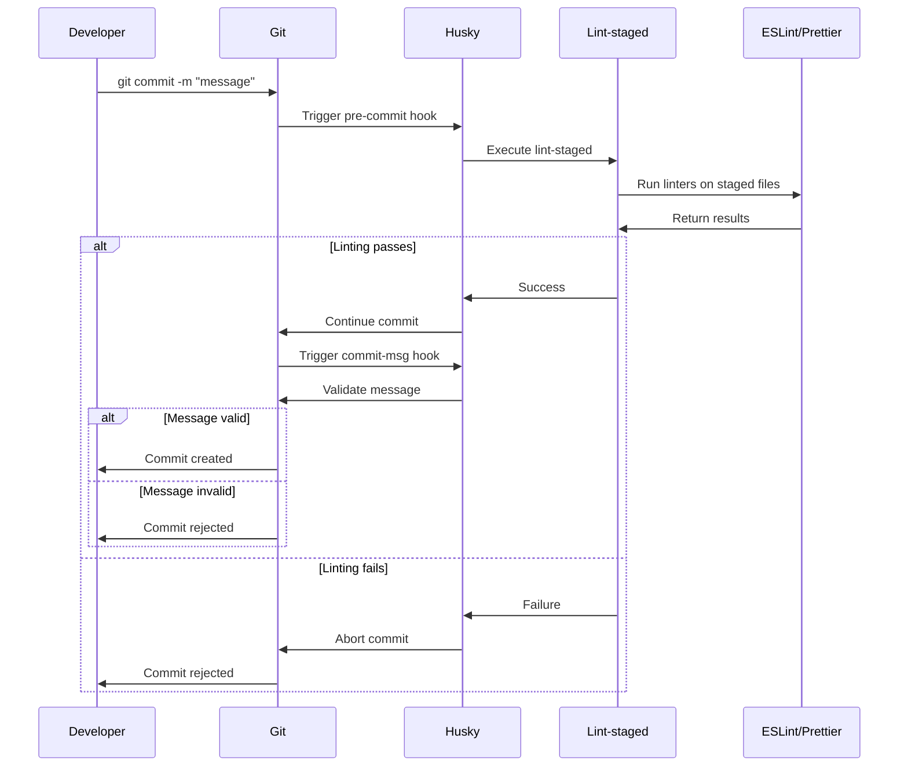

# Git Hooks & Automation

Git hooks provide automated quality checks at key points in your development workflow, ensuring code quality before changes are committed or pushed.

## Overview

This template uses **Husky** to manage git hooks with **lint-staged** for efficient file processing.

### Hooks Included

1. **pre-commit** - Runs before commits are created
2. **commit-msg** - Validates commit message format

## Husky

### What Is Husky?

Husky is a modern git hook manager that makes it easy to:

- Set up git hooks in your npm project
- Share hooks with your team via version control
- Maintain consistent workflows across all developers

### Installation

Husky is automatically installed when you run:

```bash
npm install
```

The `prepare` script in `package.json` handles setup:

```json
{
  "scripts": {
    "prepare": "husky install"
  }
}
```

### Configuration

Husky hooks are stored in `.husky/` directory and committed to version control.

## Pre-commit Hook

### Purpose

The pre-commit hook runs **before** a commit is created, catching issues early.

### Implementation

**File**: `.husky/pre-commit`

```bash
#!/usr/bin/env sh
. "$(dirname -- "$0")/_/husky.sh"

npx lint-staged
```

### What It Does

When you run `git commit`, this hook:

1. Identifies files staged for commit
2. Runs appropriate linters on those files
3. Attempts to auto-fix issues
4. Blocks commit if unfixable issues exist
5. Adds fixed files back to staging

### Workflow Example

```bash
# 1. Make changes to files
echo "const x=1" > src/index.ts

# 2. Stage files
git add src/index.ts

# 3. Attempt commit
git commit -m "feat: add new feature"

# 4. Hook runs automatically:
#    - Runs Prettier on src/index.ts
#    - Runs ESLint on src/index.ts
#    - Fixes: const x = 1;
#    - Re-stages the fixed file
#    - Commit proceeds
```

### Files Checked

**File**: `.lintstagedrc.json`

```json
{
  "**/*.{ts,js,html,json}": [
    "prettier --write",
    "eslint --fix"
  ],
  "**/*.{css,scss}": [
    "stylelint --fix"
  ]
}
```

### Performance

Lint-staged only checks **staged files**, making it fast even in large projects:

- 5 staged files = only 5 files checked
- Fast feedback loop (usually < 5 seconds)
- No unnecessary work on unchanged files

## Commit-msg Hook

### Purpose

The commit-msg hook validates your commit message format, ensuring consistent commit history.

### Implementation

**File**: `.husky/commit-msg`

```bash
#!/usr/bin/env sh
# Validate commit message format
npx --no -- commitlint --edit ${1}
```

### What It Does

When you run `git commit -m "message"`, this hook:

1. Reads your commit message
2. Validates against conventional commit format
3. Checks message length and structure
4. Blocks commit if format is invalid
5. Provides helpful error messages

### Workflow Example

```bash
# ❌ Invalid - missing type
git commit -m "added feature"
# Error: subject may not be empty [subject-empty]

# ❌ Invalid - wrong type
git commit -m "added: new feature"
# Error: type must be one of [feat, fix, docs, ...]

# ✅ Valid
git commit -m "feat: add user authentication"
# Commit proceeds

# ✅ Valid with scope
git commit -m "fix(auth): resolve login bug"
# Commit proceeds

# ✅ Valid with body
git commit -m "feat: add dark mode

This implements a theme switcher that persists
user preference across sessions."
# Commit proceeds
```

## Bypassing Hooks

### When to Bypass

You should rarely bypass hooks, but valid cases include:

- Emergency hotfixes in production incidents
- WIP commits on personal branches (but clean up before PR)
- Merge/rebase commits that inherit messages

### How to Bypass

```bash
# Bypass all hooks (use with caution)
git commit --no-verify -m "fix: emergency hotfix"

# Or use alias
git commit -n -m "fix: emergency hotfix"
```

### Warning

Bypassing hooks means:

- No code formatting
- No linting
- No commit message validation
- Potential CI/CD failures
- Code review friction

## Troubleshooting

### Hook Not Running

**Problem**: Commits succeed without running hooks

**Solutions**:

```bash
# 1. Verify Husky is installed
ls -la .husky/

# 2. Reinstall Husky
npm run prepare

# 3. Check hook permissions
chmod +x .husky/pre-commit
chmod +x .husky/commit-msg

# 4. Verify git config
git config core.hooksPath
# Should output: .husky
```

### Hook Fails Unexpectedly

**Problem**: Hook fails even though code looks correct

**Solutions**:

```bash
# 1. Check what's being staged
git diff --cached

# 2. Run linters manually
npm run lint
npm run format

# 3. Check for merge conflicts
git status

# 4. View detailed error
GIT_TRACE=1 git commit -m "test"
```

### Slow Hook Execution

**Problem**: Pre-commit hook takes too long

**Solutions**:

```bash
# 1. Verify lint-staged is configured
cat .lintstagedrc.json

# 2. Check what's staged (too many files?)
git diff --cached --name-only | wc -l

# 3. Consider committing in smaller batches
git add file1.ts file2.ts
git commit -m "feat: add feature part 1"
```

### Hook Works Locally But Not in CI

**Problem**: CI doesn't respect hooks

**Explanation**: Git hooks are **local only**. CI runs separate checks via GitHub Actions.

**Solution**: Ensure your CI workflows duplicate hook checks:

```yaml
# .github/workflows/ci.yml
- name: Lint
  run: npm run lint

- name: Check formatting
  run: npm run format -- --check
```

## Customization

### Adding New Hooks

Create a new hook file:

```bash
# Create hook
echo '#!/usr/bin/env sh
. "$(dirname -- "$0")/_/husky.sh"

npm test' > .husky/pre-push

# Make executable
chmod +x .husky/pre-push
```

### Modifying Lint-staged

Edit `.lintstagedrc.json`:

```json
{
  "**/*.{ts,js}": [
    "prettier --write",
    "eslint --fix",
    "npm test -- --findRelatedTests" // Add tests
  ]
}
```

### Disabling Specific Linters

```json
{
  "**/*.{ts,js}": [
    "prettier --write"
    // Removed eslint
  ]
}
```

## Uninstalling Husky

If you need to remove Husky completely:

```bash
# Use the provided script
npm run uninstall-husky

# Or manually
npm uninstall husky
rm -rf .husky
git config --unset core.hooksPath
```

## Best Practices

### Do

1. **Keep hooks fast** - Use lint-staged for speed
2. **Commit hooks to version control** - Share with team
3. **Test hooks work** - Make intentional errors to verify
4. **Document customizations** - Help new team members
5. **Use appropriate hooks** - pre-commit for checks, commit-msg for validation

### Don't

1. **Don't run full test suites** - Too slow for pre-commit
2. **Don't bypass hooks habitually** - Defeats the purpose
3. **Don't add network calls** - Unreliable and slow
4. **Don't make hooks OS-specific** - Team uses different systems
5. **Don't overcomplicate** - Keep hooks simple and focused

## Hook Lifecycle



## Integration with CI/CD

While hooks run locally, CI/CD provides additional verification:

| Check | Local (Hooks) | CI/CD (GitHub Actions) |
|-------|---------------|------------------------|
| Linting | Yes (pre-commit) | Yes (on PR) |
| Formatting | Yes (pre-commit) | Yes (on PR) |
| Commit Message | Yes (commit-msg) | Yes (commitlint) |
| Tests | Optional | Yes (full suite) |
| Build | No | Yes |
| Deploy | No | Yes (main branch) |

**Why duplicate checks?**

- Hooks can be bypassed locally
- CI is the source of truth
- CI checks entire codebase, not just changes
- CI runs on clean environment

## Related Documentation

- [Code Quality](code-quality.md) - What gets checked by hooks
- [Commit Management](commit-management.md) - Commit message validation
- [CI/CD Workflows](cicd-workflows.md) - GitHub Actions integration
- [Husky Setup](../technical/husky-setup.md) - Technical implementation details
