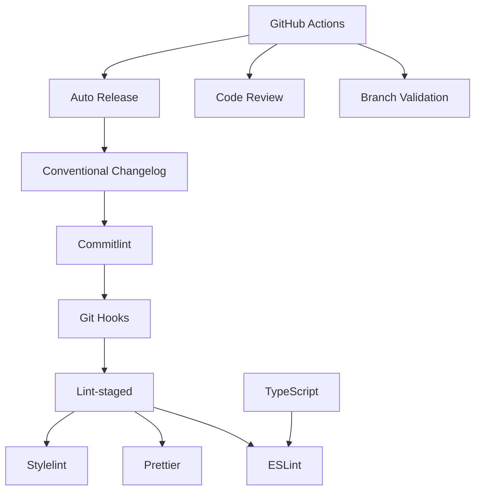

# Features Overview

This template provides a comprehensive set of features designed to streamline your Node.js library development with enterprise-grade DevOps automation.

## Feature Categories

### 1. Code Quality & Linting

Automated code quality enforcement ensures consistent, maintainable code:

- **ESLint** - JavaScript and TypeScript linting
- **Prettier** - Opinionated code formatting
- **Stylelint** - CSS and SCSS linting
- **Lint-staged** - Run linters on staged files only
- **TypeScript** - Strong typing with strict mode

[Learn more about Code Quality](code-quality.md)

### 2. Git Hooks & Automation

Intelligent git hooks that run at the right time:

- **Husky** - Modern git hook management
- **Pre-commit hooks** - Lint and format before commits
- **Commit-msg hooks** - Validate commit message format
- **Easy setup** - Automatic configuration via npm install

[Learn more about Git Hooks](git-hooks.md)

### 3. Commit Management

Enforce consistent commit messages and changelog generation:

- **Commitlint** - Conventional commit validation
- **Conventional Commits** - Standardized commit format
- **Semantic Versioning** - Automated version bumping
- **Changelog Generation** - Auto-generated release notes

[Learn more about Commit Management](commit-management.md)

### 4. GitHub Templates

Standardized templates for issues and pull requests:

- **Issue Templates** - Bug reports, feature requests, hotfixes, security, documentation
- **PR Template** - Comprehensive checklist and documentation
- **Code Owners** - Automatic review assignment
- **Issue Configuration** - Enforce template usage

[Learn more about GitHub Templates](github-templates.md)

### 5. CI/CD Workflows

Automated workflows powered by GitHub Actions:

- **Branch Naming Validation** - Enforce naming conventions
- **Automated Code Review** - GitHub Copilot integration
- **Automatic Releases** - Semantic versioning and changelog
- **Status Checks** - Prevent broken code from being merged

[Learn more about CI/CD Workflows](cicd-workflows.md)

### 6. Branch Strategy

Production-ready three-branch workflow:

- **Main** - Production code
- **Staging** - Pre-production testing
- **Develop** - Active development
- **Feature Branches** - Isolated feature development

[Learn more about Branch Strategy](branch-strategy.md)

### 7. Security

Built-in security best practices:

- **Security Policy** - Clear vulnerability reporting
- **Private Reporting** - Secure disclosure channel
- **Dependency Management** - Keep dependencies up to date
- **Environment Variables** - Secure configuration management

[Learn more about Security](security.md)

## Feature Matrix

| Feature | Included | Automated | Configurable |
|---------|----------|-----------|--------------|
| ESLint | Yes | Yes | Yes |
| Prettier | Yes | Yes | Yes |
| Stylelint | Yes | Yes | Yes |
| TypeScript | Yes | No | Yes |
| Husky Hooks | Yes | Yes | Yes |
| Commitlint | Yes | Yes | Yes |
| Branch Validation | Yes | Yes | Yes |
| Code Review | Yes | Yes | Yes |
| Auto Release | Yes | Yes | Yes |
| Issue Templates | Yes | No | Yes |
| PR Template | Yes | No | Yes |
| Branch Protection | Scripts Provided | No | Yes |
| Security Policy | Yes | No | Yes |

## Quick Feature Access

### For Developers

- **Code Formatting**: Run `npm run format`
- **Linting**: Run `npm run lint`
- **Commit**: Use conventional commit format
- **Branch**: Follow naming convention (feature/, bugfix/, hotfix/, release/)

### For Maintainers

- **Release**: Merge staging → main (auto-releases)
- **Review**: Use PR template checklist
- **Security**: Monitor security policy reports
- **Branch Protection**: Run setup scripts

### For Teams

- **Standards**: Enforced via git hooks and CI/CD
- **Consistency**: Automated formatting and linting
- **Documentation**: Issue and PR templates
- **Quality**: Code review automation

## Integration Points

### IDE Integration

This template works seamlessly with:

- **VS Code** - ESLint and Prettier extensions
- **WebStorm** - Built-in support for all tools
- **Sublime Text** - Via plugins
- **Vim/Neovim** - Via plugins

### CI/CD Integration

Compatible with:

- **GitHub Actions** - Native workflows included
- **Jenkins** - Can integrate npm scripts
- **GitLab CI** - Can adapt workflows
- **CircleCI** - Can use npm scripts

### Git Hosting

Optimized for:

- **GitHub** - Full feature support
- **GitLab** - Adapt templates and workflows
- **Bitbucket** - Adapt templates and workflows

## Feature Dependencies

## Customization Options

All features can be customized:

- **ESLint**: Edit `eslint.config.ts`
- **Prettier**: Edit `.prettierrc`
- **Stylelint**: Edit `.stylelintrc`
- **Commitlint**: Edit `commitlint.config.js`
- **Husky**: Edit `.husky/` hook files
- **Workflows**: Edit `.github/workflows/` files
- **Templates**: Edit `.github/ISSUE_TEMPLATE/` and `PULL_REQUEST_TEMPLATE.md`

## Performance Considerations

### Fast Feedback Loops

- **Lint-staged**: Only checks changed files
- **Pre-commit**: Catches issues before push
- **Parallel workflows**: GitHub Actions run concurrently

### Minimal Overhead

- **Husky**: Lightweight hook management
- **No build step**: Template is development-focused
- **Selective linting**: Only staged files checked

## Best Practices

1. **Don't bypass hooks** unless absolutely necessary
2. **Review auto-generated changelogs** before release
3. **Use squash merge** for feature branches
4. **Keep dependencies updated** regularly
5. **Customize templates** to match your workflow
6. **Document customizations** for your team

## Next Steps

Explore detailed documentation for each feature:

- [Code Quality & Linting](code-quality.md)
- [Git Hooks & Automation](git-hooks.md)
- [Commit Management](commit-management.md)
- [GitHub Templates](github-templates.md)
- [CI/CD Workflows](cicd-workflows.md)
- [Branch Strategy](branch-strategy.md)
- [Security](security.md)
