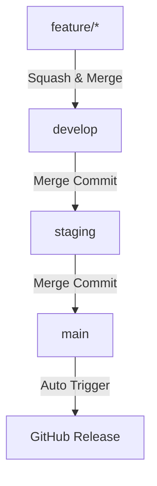

# Getting Started

This guide will help you get started with the Node.js Library Template quickly and efficiently.

## Prerequisites

Before you begin, ensure you have the following installed:

- **Node.js**: Version 20 (specified in `.nvmrc`)
- **npm**: Comes with Node.js
- **Git**: Version control system
- **GitHub Account**: For repository hosting and CI/CD

### Recommended Tools

- **nvm** (Node Version Manager): Automatically use the correct Node.js version
- **VS Code**: IDE with excellent TypeScript support
- **GitHub CLI**: For easier GitHub operations

## Installation

### Step 1: Clone the Template

```bash
# Using this template on GitHub (recommended)
# Click "Use this template" on GitHub, then clone your new repo

# Or clone directly
git clone https://github.com/btp-dev-squad/template-node-lib.git my-library
cd my-library
```

### Step 2: Install Dependencies

```bash
# Install all dependencies and set up Husky hooks
npm install
```

This command will:
- Install all npm packages
- Automatically run `npm run prepare` to set up Husky git hooks
- Configure pre-commit and commit-msg hooks

### Step 3: Configure Your Project

Update the following files with your project details:

#### `package.json`

```json
{
  "name": "your-library-name",
  "version": "1.0.0",
  "description": "Your library description",
  "author": "Your Name",
  "repository": {
    "type": "git",
    "url": "https://github.com/your-org/your-repo.git"
  }
}
```

#### `.github/CODEOWNERS`

```
* @your-team-or-username
```

### Step 4: Set Up Branch Protection (Optional)

Run the setup script to configure branch protection rules:

```bash
# Using shell script
chmod +x scripts/setup.sh
./scripts/setup.sh your-org your-repo your-github-token

# Or using Node.js script
node scripts/setup.js your-org your-repo your-github-token
```

This will protect your `main`, `develop`, and `staging` branches with:
- Required code reviews
- Status check requirements
- Protection against force pushes
- Protection against branch deletion

## Basic Usage

### Development Workflow

1. **Create a Feature Branch**

```bash
# Follow the branch naming convention
git checkout -b feature/my-awesome-feature
```

Valid branch prefixes:
- `feature/` - New features
- `bugfix/` - Bug fixes
- `hotfix/` - Critical production fixes
- `release/` - Release preparation

2. **Make Your Changes**

Edit files in the `src/` directory:

```typescript
// src/index.ts
export function myFunction() {
  return "Hello, World!";
}
```

3. **Run Quality Checks**

```bash
# Lint your code
npm run lint

# Format your code
npm run format

# Both will run automatically on commit!
```

4. **Commit Your Changes**

```bash
# Stage your files
git add .

# Commit with conventional commit format
git commit -m "feat: add new awesome feature"
```

The commit will automatically:
- Run ESLint and Prettier on staged files
- Validate your commit message format
- Prevent commit if checks fail

### Conventional Commit Format

Your commit messages must follow this format:

```
<type>(<scope>): <subject>

<body>

<footer>
```

**Types:**
- `feat`: New feature
- `fix`: Bug fix
- `docs`: Documentation changes
- `style`: Code style changes (formatting, semicolons, etc.)
- `refactor`: Code refactoring
- `perf`: Performance improvements
- `test`: Adding or updating tests
- `build`: Build system changes
- `ci`: CI/CD changes
- `chore`: Other changes (dependencies, etc.)

**Examples:**

```bash
git commit -m "feat: add user authentication"
git commit -m "fix: resolve memory leak in data processing"
git commit -m "docs: update API documentation"
git commit -m "refactor: simplify error handling logic"
```

### Push and Create Pull Request

```bash
# Push your branch
git push -u origin feature/my-awesome-feature

# Create a pull request (using GitHub CLI)
gh pr create --title "Add awesome feature" --body "Description of changes"
```

The PR template will automatically guide you through:
- Describing your changes
- Testing checklist
- Security considerations
- Deployment notes

## Available Scripts

| Script | Command | Description |
|--------|---------|-------------|
| Start | `npm start` | Run TypeScript with ts-node |
| Test | `npm test` | Run test suite (placeholder) |
| Lint | `npm run lint` | Run ESLint on TypeScript/JavaScript files |
| Lint (fix) | `npm run lint:scripts` | Auto-fix linting issues |
| Format | `npm run format` | Run Prettier and Stylelint formatting |
| Format Scripts | `npm run format:scripts` | Format JavaScript/TypeScript files |
| Format Styles | `npm run format:styles` | Format CSS/SCSS files |
| Prepare | `npm run prepare` | Set up Husky (runs automatically after install) |
| Uninstall Husky | `npm run uninstall-husky` | Completely remove Husky hooks |

## Branch Strategy

This template uses a three-branch strategy:



### Branch Purposes

- **main**: Production code, protected, receives merges from staging only
- **staging**: Pre-production testing, receives merges from develop
- **develop**: Active development, receives merges from feature branches

### Merge Strategy

- Feature → Develop: **Squash and Merge** (clean history)
- Develop → Staging: **Merge Commit** (preserve feature history)
- Staging → Main: **Merge Commit** (preserve release history)

## Troubleshooting

### Husky Hooks Not Running

```bash
# Reinstall Husky
npm run uninstall-husky
npm install
npm run prepare
```

### Commit Message Rejected

Ensure your commit message follows conventional commit format:

```bash
# Wrong
git commit -m "fixed bug"

# Correct
git commit -m "fix: resolve authentication bug"
```

### Lint Errors Preventing Commit

Fix the errors or temporarily bypass (not recommended):

```bash
# Fix errors automatically (when possible)
npm run lint:scripts

# Format code
npm run format

# Bypass hooks (not recommended)
git commit --no-verify -m "fix: emergency fix"
```

### Node Version Mismatch

Use nvm to switch to the correct Node version:

```bash
# Install and use the version specified in .nvmrc
nvm install
nvm use
```

## Next Steps

Now that you're set up, explore:

- [Features Overview](features/overview.md) - Learn about all available features
- [Technical Documentation](technical/project-structure.md) - Understand the implementation details
- [Configuration](configuration/package-scripts.md) - Customize the template

## Getting Help

- Check the [documentation](index.md)
- Review [existing issues](https://github.com/btp-dev-squad/template-node-lib/issues)
- Ask questions in [GitHub Discussions](https://github.com/btp-dev-squad/template-node-lib/discussions)
- Report security issues to: arun.krishnamoorthy@aarini.com
