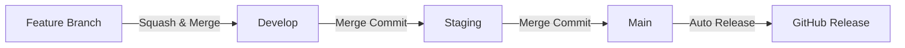

# Node.js Library Template

Welcome to the Node.js Library Template documentation! This template provides a comprehensive, production-ready foundation for building Node.js libraries with enterprise-grade DevOps tooling and automation.

## What You Get

This template is a complete starter kit that includes everything you need to build, maintain, and scale Node.js libraries with modern development practices:

### Code Quality & Standards
- **ESLint** - Automated code linting with TypeScript support
- **Prettier** - Consistent code formatting across your entire codebase
- **Stylelint** - CSS/SCSS linting with Sass guidelines
- **TypeScript** - Full TypeScript support with strict mode enabled
- **Lint-staged** - Run linters only on staged files for faster commits

### Git Workflow & Automation
- **Husky Git Hooks** - Automated pre-commit and commit-msg validation
- **Commitlint** - Enforce conventional commit message format
- **Branch Naming Validation** - Automated enforcement of branch naming conventions
- **Three-Branch Strategy** - Production-ready branching model (main/staging/develop)

### CI/CD & Release Management
- **GitHub Actions Workflows** - Automated testing, validation, and releases
- **Automated Releases** - Semantic versioning with conventional changelog
- **Code Review Automation** - GitHub Copilot integration for automated PR reviews
- **Branch Protection** - Pre-configured protection rules with automated setup scripts

### GitHub Templates
- **Issue Templates** - Standardized templates for bugs, features, hotfixes, security, and documentation
- **Pull Request Template** - Comprehensive PR checklist and documentation
- **Code Owners** - Automatic code review assignments

### Security & Best Practices
- **Security Policy** - Clear vulnerability reporting guidelines
- **Private Reporting** - Secure channel for security issues
- **Environment Configuration** - .env example with security best practices

## Quick Start

Get up and running in minutes:

```bash
# Clone this template
git clone https://github.com/btp-dev-squad/template-node-lib.git my-new-library

# Navigate to your project
cd my-new-library

# Install dependencies (automatically sets up Husky hooks)
npm install

# Start developing
npm start
```

## Key Features

### Automated Code Quality

Every commit is automatically checked for:
- Code style compliance (ESLint, Prettier)
- TypeScript type errors
- CSS/SCSS best practices (Stylelint)
- Conventional commit message format

### Streamlined Git Workflow

The template enforces a structured workflow:



### Continuous Integration

GitHub Actions automatically:
- Validates branch naming conventions
- Reviews code for security and performance issues
- Generates changelogs and releases
- Enforces code quality standards

## Who Should Use This Template?

This template is perfect for:

- Teams building reusable Node.js libraries
- Organizations requiring standardized development practices
- Projects needing enterprise-grade DevOps automation
- Developers wanting to learn modern Node.js tooling
- Open source projects requiring structured contribution workflows

## Philosophy

This template follows these core principles:

1. **Automation First** - Minimize manual processes through intelligent automation
2. **Quality by Default** - Enforce best practices without requiring configuration
3. **Developer Experience** - Fast, frictionless workflows that don't get in the way
4. **Security Conscious** - Built-in security best practices and vulnerability management
5. **Production Ready** - Enterprise-grade tooling suitable for critical applications

## What's Next?

- [Getting Started](getting-started.md) - Detailed setup and usage guide
- [Features Overview](features/overview.md) - Explore all template features
- [Technical Documentation](technical/project-structure.md) - Deep dive into implementation details
- [Configuration](configuration/package-scripts.md) - Customize the template for your needs

## Support

Need help or want to contribute?

- **Issues**: Report bugs or request features via [GitHub Issues](https://github.com/btp-dev-squad/template-node-lib/issues)
- **Security**: Report vulnerabilities privately to arun.krishnamoorthy@aarini.com
- **Discussions**: Join the conversation in [GitHub Discussions](https://github.com/btp-dev-squad/template-node-lib/discussions)

---

**Made with care by the Aarini Dev Squad**
